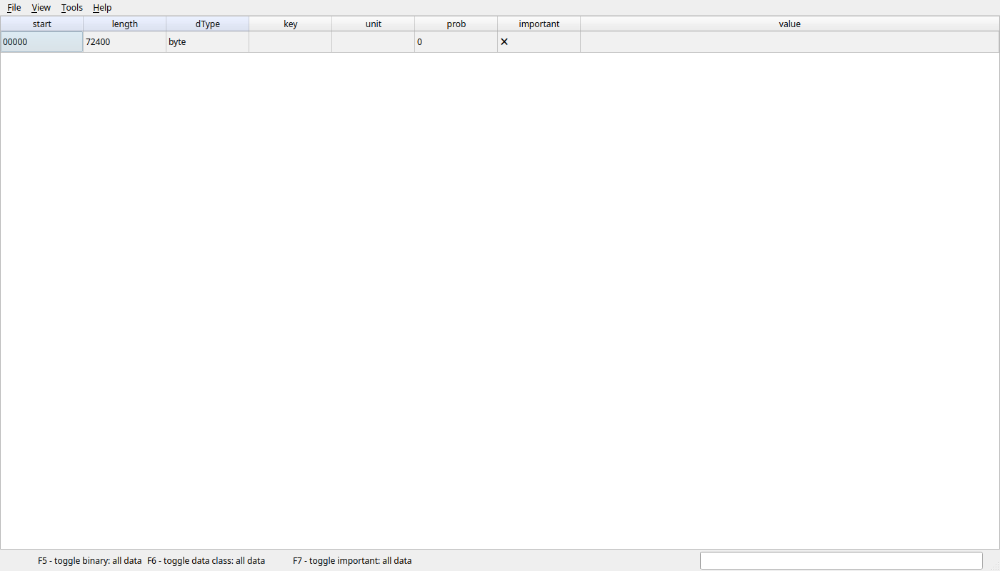
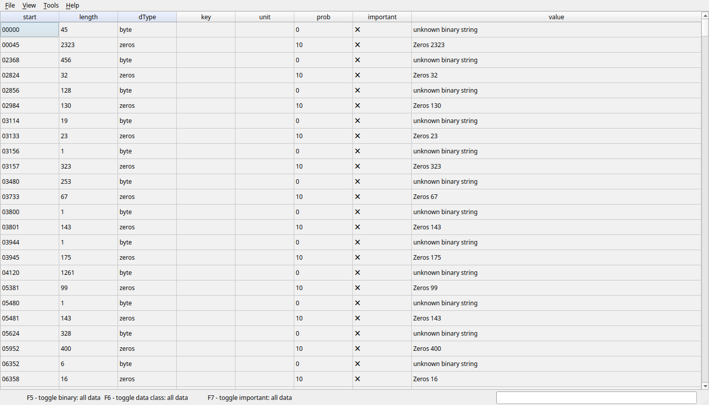
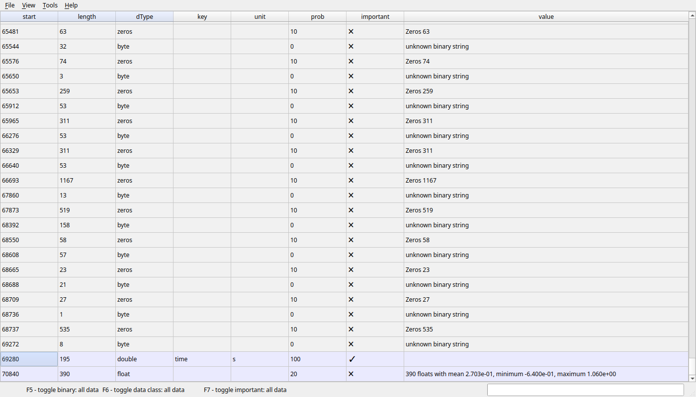
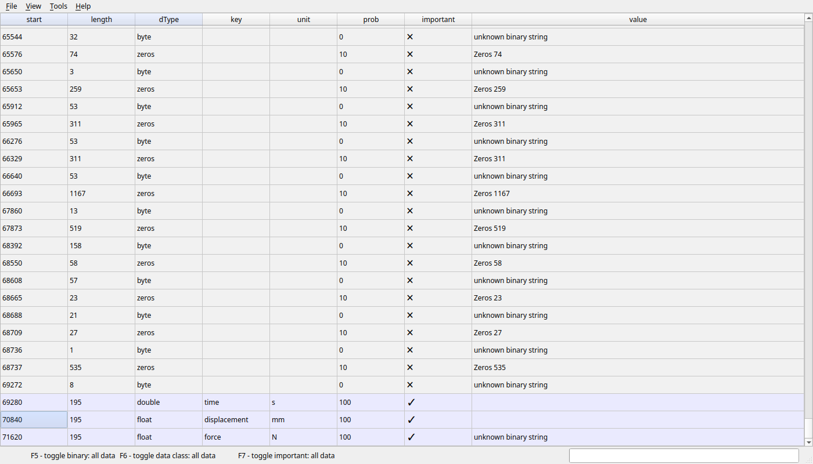
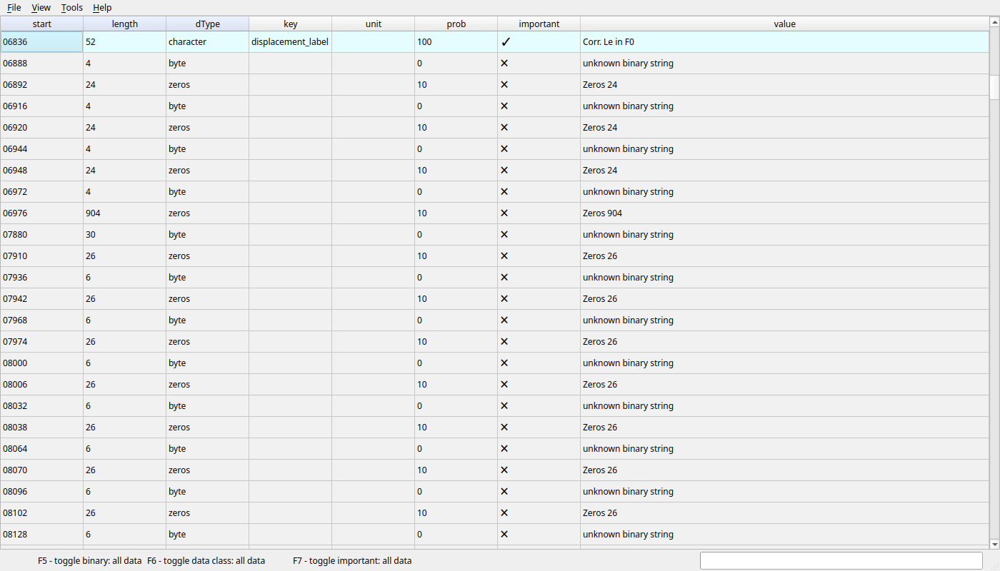
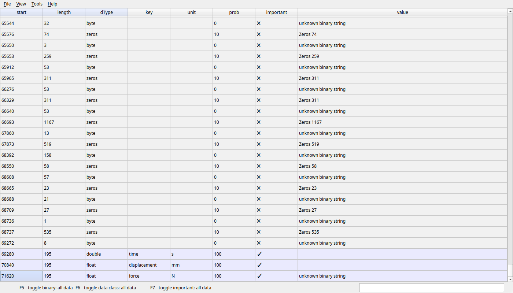

GUI tutorial: identifying a real sample file
**********************************************

This tutorial shows the same sample workflow as the command-line example,
using the MARBLE graphical user interface. The screenshots are generated by
``tests/test_gui_tutorial.py`` so that the documentation stays aligned with
the current GUI.

The test uses a temporary copy of
``tests/examples/Membrane_Repeatability_05.mvl``. It never changes the source
sample, and stores the screenshots in
``docs/source/_static/GuiTutorial/``.

Running the screenshot test
===========================

Run the following command from the repository root::

   .venv/bin/python -m pytest tests/test_gui_tutorial.py -q

The test opens the GUI at a fixed size and captures the table after each
important step. The GUI is run in the test environment, so it does not require
you to click through the workflow manually.

Step 1: open the sample file
============================

The first screen shows the file after it has been opened. Initially, MARBLE
has very little scientific information about the file. The table contains the
file's current section interpretation, including offsets, lengths, types,
confidence, and importance.

Step 2: run automatic identification
====================================

Automatic identification proposes sections based on patterns such as text,
zero-filled regions, and numeric series. It does not know which values are
force, displacement, or time. Treat the result as evidence to review rather
than as a finished interpretation.

Step 3: label the time signal
=============================

The sample's time signal starts at offset 69280 and contains 195 doubles. In
the GUI, select the corresponding section and edit its start, length, type,
key, and unit in the section form. The screenshot shows the result after the
time section has been labeled as ``time`` in seconds.

Step 4: label the measured signals
==================================

The displacement and force signals each contain 195 floats. Label the first
as displacement in millimetres and the second as force in newtons. A float is
4 bytes, so each section occupies 780 bytes.

Step 5: label metadata
======================

Metadata sections describe the experiment rather than containing the main
measurements. The sample includes labels for displacement, force, process name,
an additional name, and a path. Mark the sections that should be exported as
important.

Step 6: save the converter
==========================

Use **File → Save python-file** or the save shortcut to generate a Python
converter next to the binary file. The converter can then be run on this and
other files from the same instrument. Inspect the generated HDF5 file as
described in :doc:`concepts`.

What to check before saving
===========================

Before saving a converter, confirm that:

* the data type gives plausible values and the expected byte size;
* the length agrees with the number of measurements;
* the unit and key match the experiment; and
* only sections intended for export are marked important.

If any of these checks fail, keep the last working ``.tags`` file, change one
property at a time, and inspect the result again. These files can be opened with wxHexEditor.
